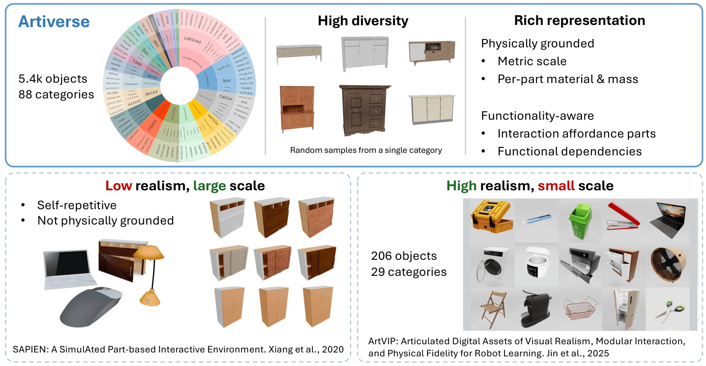

# Artiverse: A Diverse and Physically Grounded Dataset for Articulated 3D Objects

[Denys Iliash](https://diliash.github.io)<sup>1</sup>,
[Jiayi Liu](https://sevenljy.github.io/)<sup>1</sup>,
[Egor Fokin](https://www.linkedin.com/in/edfokin/)<sup>1</sup>,
[Qirui Wu](https://qiruiw.github.io/)<sup>1</sup>,
[Ali Mahdavi-Amiri](https://www.sfu.ca/~amahdavi/)<sup>1</sup>,
[Manolis Savva](https://msavva.github.io/)<sup>1</sup>,
[Angel X. Chang](https://angelxuanchang.github.io)<sup>1,2</sup>

<sup>1</sup>Simon Fraser University, <sup>2</sup>Canada-CIFAR AI Chair, Amii

### [Project Page](https://3dlg-hcvc.github.io/artiverse/)

The dataset is released on [Hugging Face](https://huggingface.co/datasets/3dlg-hcvc/artiverse).

We present **Artiverse**, a diverse and physically grounded dataset of high-quality articulated 3D objects designed for realistic functional modeling and simulation.

Artiverse contains **5.4K** human-authored objects across **88 categories**, aggregated from multiple 3D static repositories. Objects are annotated with functional parts, interior structures, realistic kinematic relationships and articulated joints (including multi-DoF joints), and physical attributes such as metric scale, material, and mass.



## Data

The Artiverse dataset is available on [Hugging Face](https://huggingface.co/datasets/3dlg-hcvc/artiverse).

Please follow the dataset card for access and terms. After approval, authenticate with the Hugging Face CLI and download with Git LFS:

```bash
git lfs install
git clone https://huggingface.co/datasets/3dlg-hcvc/artiverse
```

## Usage Examples

Make sure you initialized the submodules using:

```bash
git submodule update --init --recursive
```

Visualize a processed mesh from the dataset and write outputs (e.g., renders/videos) under `output/`:

```bash
python view_model.py --model_path data/desk/fpModel/ea4826625a4ad17e2bd2f4013acdb1c26b568999 --output_dir output
```

## Acknowledgements

This work was funded in part by a CIFAR AI Chair, a Canada Research Chair, and NSERC Discovery grants, and supported by the Digital Research Alliance of Canada. We thank our annotators for their dedication in ensuring the data quality.

## Citation

Please cite our work if you use Artiverse.

```bibtex
@inproceedings{iliash2026artiverse,
  title={Artiverse: A Diverse and Physically Grounded Dataset for Articulated Objects},
  author={Iliash, Denys and Liu, Jiayi and Fokin, Egor and Wu, Qirui and Mahdavi-Amiri, Ali and Savva, Manolis and Chang, Angel X.},
  booktitle={Proceedings of the IEEE/CVF Conference on Computer Vision and Pattern Recognition (CVPR)},
  year={2026}
}
```
